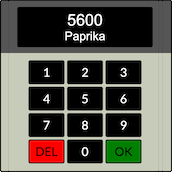

# [VGDD](https://vgdd.stackblitz.io/)

### [https://vgdd.netlify.app/](https://vgdd.netlify.app/) - hosted on netlify (use this)

### [https://vgdd.stackblitz.io](https://vgdd.stackblitz.io/) - hosted on stackblitz (reloads after inactivity / pause app)

This app will help you shopping in [VG stores.](https://www.vg-dresden.de/unsere-maerkte) It simply save the number and the product in a list and persist that to local storage. You can customize this App on [StackBlitz ⚡️](https://stackblitz.com/edit/vgdd)

 
